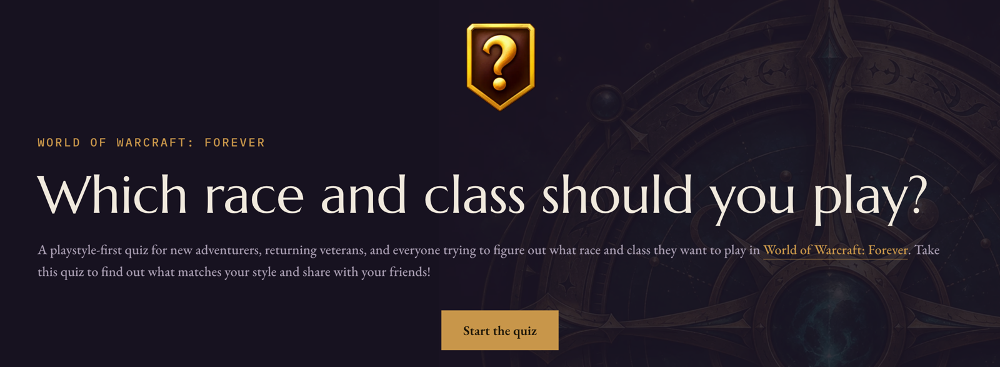
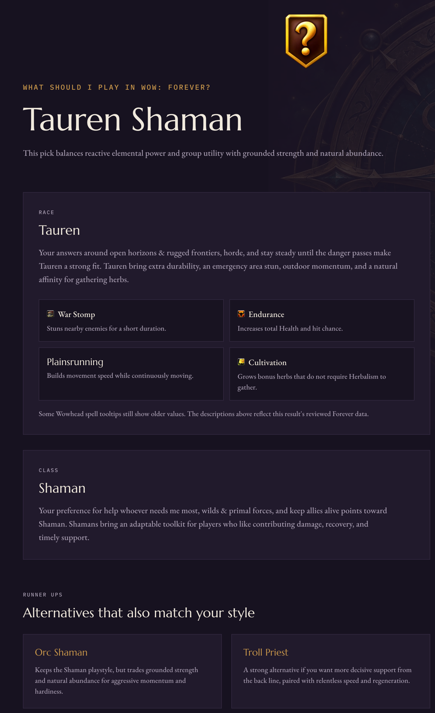

# What Should I Play?

A 13-question quiz that suggests a race and class for *World of Warcraft: Forever*. It asks how you like to play, and gives you one main pick plus two alternatives you can share with friends.

## What you get

After the last question you land on a result page with its own shareable link:

- **Your main pick**, such as *Tauren Shaman*, with a short explanation for the race and the class based on the answers
- **The race's racial abilities**, so you can see what the race actually does for you
- **Two alternatives**: one keeps your class with a different race, the other suggests a different class
- A retake prompt if the game data has changed since you took the quiz

## The questions

The quiz covers:

1. When you started playing WoW
2. Which faction you lean toward
3. What you're most excited to do in Forever (questing, dungeons, raids, PvP, crafting, exploration, community)
4. What you like to contribute to a group
5. How you like to fight
6. How you react when a fight gets unpredictable
7. How you feel about pets and summoned companions
8. The kinds of adventures you enjoy (solo, duo, small or large groups, open world)
9. Which character fantasy pulls you in
10. What you do first when a plan falls apart
11. Which atmosphere appeals to you, including a choice between living forests and haunted glades
12. Up to three things that would annoy you most
13. Whether you want a focused class identity or room to change jobs and tactics

Some questions take a single answer. Others ask you to **rank** up to three picks (two for character fantasy). For question 12, “None of these” is a standalone answer.

## How scoring works

The scoring is deterministic. There's no randomness and no AI involved, so the same answers and the same game data always give the same result.

### 1. Every valid combination is scored

The quiz scores all 56 race and class combinations available in Forever and never suggests a pairing you can't create.

### 2. Each answer gives points to classes and races

Most answers add up to 3 points to the classes and races they fit. For example, *Keep allies alive* favors Priest, Paladin and Shaman, while *Ranged weapons & a companion* favors Hunter and Warlock. Questions 12 and 13 can also subtract points (as low as −3 before question and rank weights) when a class conflicts with a frustration or a preference for focused play.

### 3. Questions carry different weight

Some questions say more about class and others say more about race. Each question has a separate class weight and race weight:

| Question | Class weight | Race weight |
| --- | :---: | :---: |
| Fighting style | 3 | — |
| Character fantasy | 3 | — |
| How you react when a fight gets unpredictable | 2.5 | — |
| Faction | — | 2.5 |
| Focused or flexible play | 2 | — |
| Group contribution | 2 | — |
| Pets and companions | 1.5 | — |
| Frustrations you rank | 1.5 | 0.6 |
| What you do when a plan falls apart | — | 2.2 |
| Adventures you enjoy | 1 | 0.3 |
| What you're excited about | 0.8 | 1.2 |
| When you started playing | 0.5 | 0.8 |
| Atmosphere | 0.3 | 3 |

The first question has a light effect on both scores. Earlier starts slightly favor racials that reward timed use, while recent or first-time play slightly favors lower-maintenance racials and classes with a forgiving solo start. Hunter gets a small boost at both ends: it is approachable for newcomers and evokes classic WoW for early players. These are soft preferences, not measures of skill; direct playstyle answers carry more weight. The Alliance and Horde descriptions are flavor text and do not change faction scoring.

### 4. Your first ranked pick counts most

For ranked questions, one question's worth of points is split across your picks:

| Picks | 1st | 2nd | 3rd |
| --- | :---: | :---: | :---: |
| 1 | 100% | | |
| 2 | 62.5% | 37.5% | |
| 3 | 55.6% | 33.3% | 11.1% |

If one option is a clear favorite, pick only that one and it gets the full weight.
Question 12 uses these same factors, so ranking three frustrations splits its existing weight across them instead of tripling its influence.

### 5. Class fit comes first

The quiz first ranks classes by their class points. If classes tie, your first-ranked picks, then your answer about unpredictable fights, break the tie. It then ranks the playable races for the winning class by race points. A strong race match cannot change the class recommendation.

Saved results retain a combined numeric score for compatibility with older records, but that number does not choose the winner. The class and race rankings do.

### A few special rules

- **Faction is just a preference.** Choosing Alliance or Horde gives that faction's races a large boost, but a strong enough match on the other side can still win.
- **Community players get more say in atmosphere.** Ranking *Community & the vibes* doesn't favor either faction. Instead, it makes the race and class points from your atmosphere answer count more: ×1.5 when ranked first, ×1.3 second, ×1.15 third. The class effect remains small compared with fighting style and character fantasy.
- **Focused play is a strong preference, not an exclusion.** Choosing a defined playstyle boosts focused classes and lowers adaptable classes. Strong answers elsewhere can still favor an adaptable class.

### Picking the alternatives

The alternatives aren't just the 2nd- and 3rd-highest scores, since those would often be near-duplicates of your main pick. Instead you get:

- **The next race for the winning class**, to show what changing only your race would do
- **The next class with its best playable race**, if you want a different playstyle

## How the data is kept up to date

The race and class list, which combinations are allowed, and each race's racials are checked by hand against:

- Blizzard's [*What's Next* panel recap](https://worldofwarcraft.blizzard.com/en-us/news/24303862/world-of-warcraft-forever-whats-next-panel-recap)
- Blizzard's [*Deep Dive* panel recap](https://worldofwarcraft.blizzard.com/en-us/news/24303313/world-of-warcraft-forever-deep-dive-panel-recap)
- Wowhead's [racials and class-race combinations guide](https://www.wowhead.com/forever/guide/new-race-class-combinations)

Each review gets a data version and a "checked on" date, shown on the site's [How this works](https://www.whatshouldiplayinwowforever.com/methodology) page.

**Shared results stay the same for 12 months.** Each result saves your answers, quiz version, and data version, so a shared link shows the same pick until it expires 12 months after creation. If the game data or quiz scoring changes before then, the result page offers a retake with the current version. Expired links show a not-found page.

New results receive a Redis expiry automatically. To apply the policy to results created before this change, run `node --env-file=.env.local scripts/backfill-result-retention.mjs` to preview the counts, then rerun with `--apply`. The script deletes already expired results and sets expiry dates on the rest. It also expires old completion markers; monthly aggregate statistics remain available.

The recommendations are about what you might enjoy playing, not a prediction of the best build on launch day.
General class descriptions help inform the quiz where Forever-specific details are not yet published; those fit judgments are provisional.

## Built with

Next.js, React, Tailwind CSS and Upstash Redis, hosted on Vercel.

## License

See [LICENSE](LICENSE).
